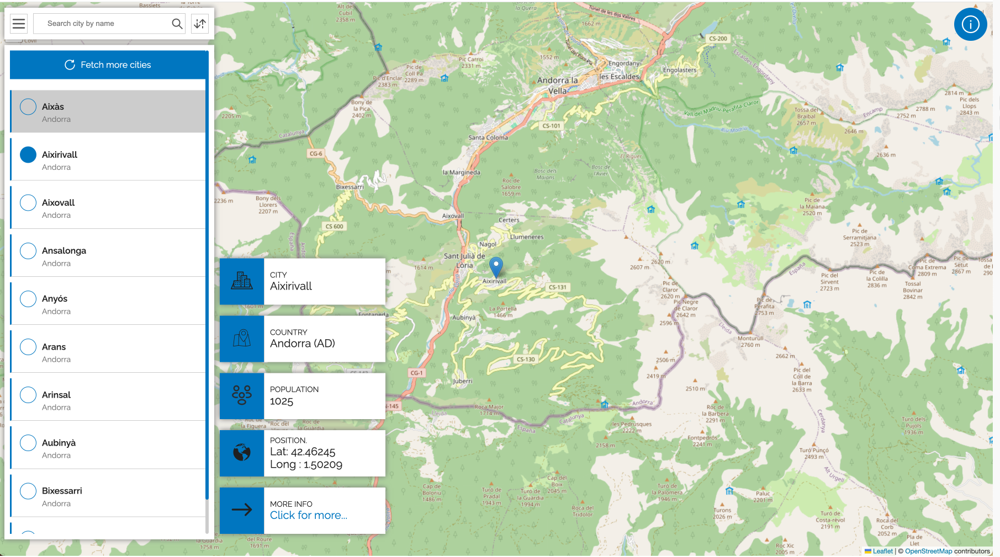

# Geo city app

 A simple web app for visualizing cities. The city's location is marked on the map, and detailed information about the selected city is displayed on the page.

 The site has been deployed at [Geo city App](https://cool-croissant-3dce44.netlify.app/)

 

 The techs used for the app are:
- [React](https://react.dev/) 
- [Typescript](https://www.typescriptlang.org/)
- [SCSS](https://sass-lang.com/)
- [React Leaflet](https://react-leaflet.js.org/)
    Leaflet is a lightweight, open-source JavaScript library for building interactive maps. The location of a city will be visualized on the map.
- [Vite](https://vite.dev/) 
- [Jenkin](https://www.jenkins.io/)
- [Deployment - netlify](https://www.netlify.com/)

## Running app locally

  #### GeoDB Cities
  The app uses GeoDB Cities from rapidap to fetch cities. [Please signup on the apidapi](https://rapidapi.com/wirefreethought/api/geodb-cities) and get the personal apidapi key which is necessary while requesting an API.

  #### local repository
- Clone the repository.
- Npm install to install all the dependencies.
- Rename the file .env.example to .env and change the content as below

```
  VITE_GEO_HOST=wft-geo-db.p.rapidapi.com
  VITE_GEO_HOST_KEY=[your-x-rapidapi-key]
```

  - Run npm dev to build the application locally.

## Build and deploy

  #### Jenkins
  Jenkin pipleline is core for the app's automation. The *Jenkinfile* has been written to get the **main** branch from the repository and run the build.

  Use the jenkin portal to save the the **x-rapidapi-key** from rapidapi as the id **geo-host-key**. This is required to set the .env varaibale during deployment.

  #### Netlify deployment
  The app will be deployed to Netlify. For the deployment you need to have Netlify account. Please sign up and get you SITE_ID and AUTH_TOKEN. Save the AUTH_TOKEN in the Jenkin credentials.

  ```
      environment{
        //netlify side Id.
        // netlify auth token saved in jenkin credentials
        NETLIFY_SITE_ID = [site-id]
        NETLIFY_AUTH_TOKEN = credentials('netlify-token')
    }
  ```